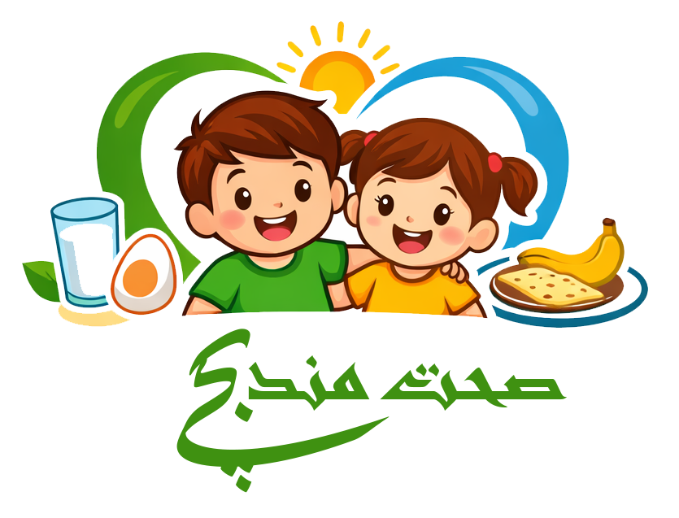

<div align="center">



# Sehat Mand Bachay — صحت مند بچے

**Pediatric SAM Assessment & Diet Planning Tool for Pakistan**

*Built for doctors, nurses, and community health workers in low-resource settings*

---


</div>

---

## What is this?

Severe Acute Malnutrition (SAM) affects millions of children under five across Pakistan. Managing it
correctly -- calculating the right caloric targets, selecting the right therapeutic formula, tracking
daily intake -- is genuinely difficult, especially in district hospitals and rural health centers
where a dietitian may not be available.

SehatMand Bachay takes some of that cognitive load off. Enter a child's measurements and the app
tells you their WHO classification, which treatment phase they are in, what their daily energy and
protein targets should be, and helps you build a realistic diet plan using foods that are actually
available and affordable in Pakistan.

It works offline. It is available in Urdu. It runs in any browser with no installation.

---

## Features

### Clinical Assessment
- WHO MUAC / WHZ-based SAM / MAM / Normal classification
- Bilateral pitting edema detection
- Automatic phase identification: Stabilization -> Transition -> Rehabilitation
- Per-kg daily targets for energy, protein, fat, and carbohydrates
- Refeeding syndrome warning during stabilization phase
- Visual MUAC color-band indicator (red / yellow / green)

### Diet Planner
- 89 pre-loaded Pakistani foods with full nutrition data per 100g
- Data sourced from PFCT 2019, Pakistan NNS 2018, and USDA FDC
- Real-time macro tracking with progress bars against phase targets
- Smart suggestions engine -- detects calorie/protein/fat deficits and recommends foods
- Organize meals by breakfast, lunch, dinner, or snacks
- Export diet plan as a PDF (English)
- Urdu RTL print layout for patient-facing handouts

### F-75 / F-100 Module
- WHO formula composition reference
- Local recipe calculator (milk, sugar, cereal, oil)
- Volume calculator -- ml per feed based on child weight and phase
- Side-by-side comparison of formula vs local recipe

### Food Database
- Add custom local or facility-specific foods
- Syncs to Firebase Firestore (cloud) with automatic localStorage fallback
- Full Urdu name support, cost rating, food category, and clinical tips per item
- Edit and delete custom foods

### App & UI
- GitHub-style dark / light theme toggle (preference saved)
- Urdu / English language toggle with full RTL layout switch
- Installable PWA -- add to home screen, works fully offline
- Firebase sync with zero-config localStorage fallback

---

## Food Library

The 89 built-in foods cover what is actually eaten across Pakistan:

| Category | Items | Examples |
|---|---|---|
| Cereals & Grains | 13 | Roti, Rice, Suji, Naan, Dalia, Oatmeal |
| Pulses & Legumes | 9 | Masoor, Mung, Chana, Toor, Urad Daal |
| Dairy | 8 | Cow's milk, Dahi, Paneer, Khoya, Malai |
| Eggs, Poultry & Meat | 13 | Egg, Chicken, Beef, Liver, Keema, Peanut butter |
| Vegetables | 13 | Potato, Palak, Gajar, Sweet Potato, Saag |
| Fruits | 10 | Banana, Dates, Mango, Guava, Pomegranate |
| Fats & Sweeteners | 7 | Ghee, Oil, Sugar, Gur, Honey |
| Mixed Dishes | 10 | Khichri, Haleem, Kheer, Daal Chawal, Laddu |
| Therapeutic | 6 | RUTF, RUSF, CSB++, BP-100, DSM, ORS |

Each food entry includes: calories, protein, fat, carbs per 100g -- plus Urdu name, cost rating,
and a contextual clinical or preparation tip.

---

## Getting Started

No build step, no package manager, no framework. Just open the file.

```
Open index.html in any modern browser.
```

**Browser compatibility:**
```
Chrome 90+    Firefox 88+    Safari 14+    Edge 90+
```

### For PWA and offline support

Service workers require HTTP. Start a local server:

```bash
# Python
python -m http.server 8080

# Node.js
npx serve .
```

Then open: `http://localhost:8080`

---

## Firebase Setup (Optional)

The app works completely without Firebase. All data falls back to localStorage automatically.
Only set this up if you want cloud sync across devices or a shared food database across a team.

**1. Create a Firebase project**

Go to [console.firebase.google.com](https://console.firebase.google.com), create a project,
and add a Web App.

**2. Edit `js/firebase-config.js`**

```javascript
const FIREBASE_CONFIG = {
  apiKey:            "YOUR_API_KEY",
  authDomain:        "your-project.firebaseapp.com",
  projectId:         "your-project-id",
  storageBucket:     "your-project.appspot.com",
  messagingSenderId: "000000000000",
  appId:             "1:000000000000:web:xxxxxxxxxxxx"
};
```

**3. Create a Firestore database**

Firestore -> Create database -> Start in test mode.

**4. Add security rules (for production)**

```
rules_version = '2';
service cloud.firestore {
  match /databases/{database}/documents {
    match /foods/{docId}       { allow read, write: if true; }
    match /diets/{docId}       { allow read, write: if true; }
    match /assessments/{docId} { allow read, write: if true; }
  }
}
```

> For clinical / hospital deployment, replace `if true` with Firebase Authentication rules.

---

## Deploying to GitHub Pages

```bash
git init
git add .
git commit -m "initial commit: SehatMand Bachay"
git branch -M main
git remote add origin https://github.com/YOUR_USERNAME/sehatmandbachay.git
git push -u origin main
```

Then in your repo: **Settings -> Pages -> Source: main / (root) -> Save**

Live at: `https://YOUR_USERNAME.github.io/sehatmandbachay/`

---

## Installing as a PWA

| Platform | Steps |
|---|---|
| Android (Chrome) | Three-dot menu -> "Add to Home Screen" |
| iOS (Safari) | Share button -> "Add to Home Screen" |
| Desktop (Chrome / Edge) | Install icon in the address bar |

Full offline functionality after first load.

---

## Clinical Reference

### WHO Classification

| Classification | MUAC | WHZ Score | Edema |
|---|---|---|---|
| **SAM** | < 11.5 cm | < -3 SD | Any bilateral pitting edema |
| **MAM** | 11.5 - 12.5 cm | -3 to -2 SD | None |
| **Normal** | >= 12.5 cm | >= -2 SD | None |

SAM is diagnosed when **any single** criterion is met.

### Daily Targets by Treatment Phase

| Phase | Energy | Protein | Typical Formula |
|---|---|---|---|
| Stabilization | 80-100 kcal/kg/day | 1-1.5 g/kg/day | F-75 |
| Transition | 100-130 kcal/kg/day | 2-3 g/kg/day | F-100 |
| Rehabilitation | 150-220 kcal/kg/day | 4-6 g/kg/day | RUTF / local foods |

*Based on: WHO Management of Severe Acute Malnutrition in Infants and Children (2013)*

### Local F-75 Recipe (per 1000 ml)

| Ingredient | Amount |
|---|---|
| Dried skimmed milk (DSM) | 25 g |
| Sugar | 70 g |
| Cereal flour (suji/rice) | 35 g |
| Vegetable oil | 27 ml |
| Water | to 1000 ml |

**Energy: 75 kcal / 100ml. Protein: 0.9 g / 100ml.**

---

## File Structure

```
sehatmandbachay/
|-- index.html              <- Single-page app (all views)
|-- style.css               <- Responsive CSS (light + dark themes)
|-- manifest.json           <- PWA manifest
|-- sw.js                   <- Service worker for offline caching
|-- README.md
|-- js/
    |-- firebase-config.js  <- Firebase credentials (edit this)
    |-- nutrition.js        <- WHO classification & requirements calculator
    |-- food-database.js    <- 89 foods + Firebase/localStorage CRUD
    |-- suggestions.js      <- Deficit detection & suggestion engine
    |-- diet-planner.js     <- Diet chart builder & macro tracker
    |-- pdf-export.js       <- English PDF (jsPDF) + Urdu browser print
    |-- app.js              <- Navigation, F-75 module, app init
```

---

## Tech Stack

| Library | Version | Used For |
|---|---|---|
| Firebase Compat | 9.22.2 | Firestore cloud storage |
| jsPDF | 2.5.1 | PDF diet plan generation |
| html2canvas | 1.4.1 | Render chart to canvas for PDF |
| Chart.js | 4.4.0 | Macro progress visualization |
| Font Awesome | 6.5.1 | Icons |
| Google Fonts | -- | Inter (UI) + Noto Nastaliq Urdu |

No build step. No bundler. No node_modules. Just open the HTML file.

---

## Security Notes

- Firebase config keys are client-side by design -- harden access via Firestore Security Rules
- For hospital deployment, enable Firebase Authentication and restrict rules accordingly
- `localStorage` data is not encrypted -- avoid storing identifiable patient data client-side in
  sensitive environments
- Never commit real patient records to version control

---

## Disclaimer

This tool is a clinical decision-support aid, not a replacement for professional medical judgment.
All diagnosis and treatment decisions must be made by qualified healthcare providers.

- Always screen for medical complications before initiating nutritional therapy
- SAM with complications (edema, severe infection, hypoglycemia) requires inpatient management
- Calculations follow WHO IMCI and SAM Management Protocol (2013)
- Consult a registered dietitian or physician for individual patient care plans

---

## License

MIT -- free to use, modify, and deploy.
